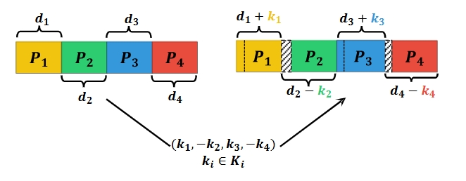

<!--
 * @Author: WANG Maonan
 * @Date: 2023-03-22 16:59:42
 * @Description: README for Paper AAP with CCDA
 * @LastEditTime: 2024-06-13 01:45:18
-->
# Traffic Signal Cycle Control with Centralized Critic and Decentralized Actors under Varying Intervention Frequencies

This repository contains the code for the paper "Traffic Signal Cycle Control with Centralized Critic and Decentralized Actors under Varying Intervention Frequencies".

- [Traffic Signal Cycle Control with Centralized Critic and Decentralized Actors under Varying Intervention Frequencies](#traffic-signal-cycle-control-with-centralized-critic-and-decentralized-actors-under-varying-intervention-frequencies)
  - [🎉 News](#-news)
  - [🔑 Key Points](#-key-points)
  - [📥 Installation](#-installation)

## 🎉 News

1. We have transitioned the simulation platform in the project from Aiolos to [TransSimHub](https://github.com/Traffic-Alpha/TransSimHub) (TSHub). We extend our gratitude to our colleagues at SenseTime, **@KanYuheng (阚宇衡)**, **@MaZian (马子安)**, and **@XuChengcheng (徐承成)** (listed alphabetically) for their contributions. The development of TransSimHub (TSHub) is built upon the foundation of Aiolos.

## 🔑 Key Points

- **Adaptation to Varying Intervention Frequencies**: The intervention frequency significantly impacts the effectiveness of traffic signal control systems, influenced by factors such as resource limitations, safety, traffic flow disruption, and system stability. This research introduces varying intervention frequencies to the TSC system, defining it as the rate at which traffic signals are adjusted in response to changing traffic conditions. This approach is particularly beneficial for scenarios requiring manual verification, where lower frequencies may be preferable.

<div align=center>
   
</div>
<p align="center">An example of applying the intervention frequency based on cycle-based control action design in a four-phase traffic signal system</p>


- **Enhanced Action Utilization**: To accommodate varying intervention frequencies, particularly lower frequencies, it is crucial for the control agent to maximize the impact of each action taken. Our research introduces a novel action strategy named `adjust all phases`, which allows for the simultaneous adjustment of all traffic phases within a single cycle, thereby increasing the effectiveness of each intervention.

<div align=center>
   
</div>
<p align="center">An example of adjust all phases in a four phases traffic signal system</p>


- **Efficient Management of Large Action Spaces**: This research employs a Centralized Critic and Decentralized Actors (CCDA) architecture to effectively manage large action spaces. Decentralized actors are responsible for adjusting individual signal phases, which reduces the complexity of the action space. Simultaneously, a centralized critic evaluates the overall traffic scenario, ensuring coordinated actions among the decentralized actors, thus enhancing overall system performance.

<div align=center>
   
</div>
<p align="center">The framework of our method with the intervention frequency</p>


## 📥 Installation

Before using, make sure [TSHub](https://github.com/Traffic-Alpha/TransSimHub/tree/main) is installed.

```shell
git clone https://github.com/Traffic-Alpha/TransSimHub.git
cd TransSimHub
pip install -e ".[rl]"
```


<!-- ## Five Action Designs in existing RL-based TSC methods

The existing RL-based studies primarily employ one of the following four action designs:

- [Choose next phase](./ChooseNextPhase), choosing a phase among all possible phases at each time step.
- [Next or not](./NextorNot/), determining whether to change to the next phase or not at each time step. 
- [Set current phase duration](./SetCurrentPhaseDuration/), setting the phase duration at the beginning of each phase.
- [Adjust single phase](./CycleSinglePhaseAdjust/), modifying only one phase in the whole cycle. 

The following figure illustrates examples of these four action designs for a TSC system with four phases, with the assumption that the starting time is at time $t$.

<div align=center></div>

There are two variants of `adjust all phases`:

- [MDLight (Discrete)](./CyclePhaseAdjust_Discrete/).  This approach directly applies adjust all phases, where the action space covers all possible combinations of all phase duration changes. However, action space will increase exponentially when the number of phases becomes larger. The PPO-Clip model is used in this approach.
- [MDLight (Multi-Discrete)](./CyclePhaseAdjust_MultiDiscrete/). In contrast to the simple adjust all phases approach, MDLight (multi-discrete) converts discrete actions to multi-discrete actions by using a vector of individual discrete actions for each phase. This approach significantly reduces the size of the action space, especially when the number of signal phases is large. Furthermore, the multi-discrete policy optimization algorithm is utilized to optimize the policy. -->