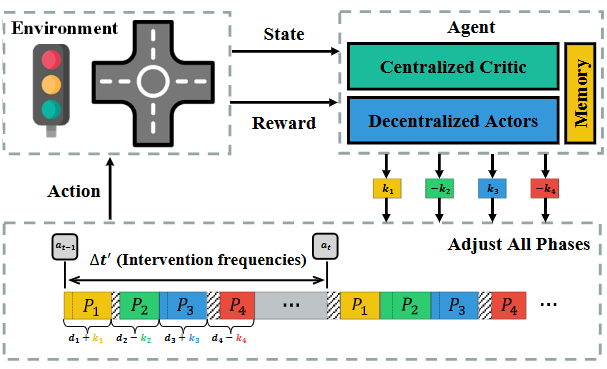
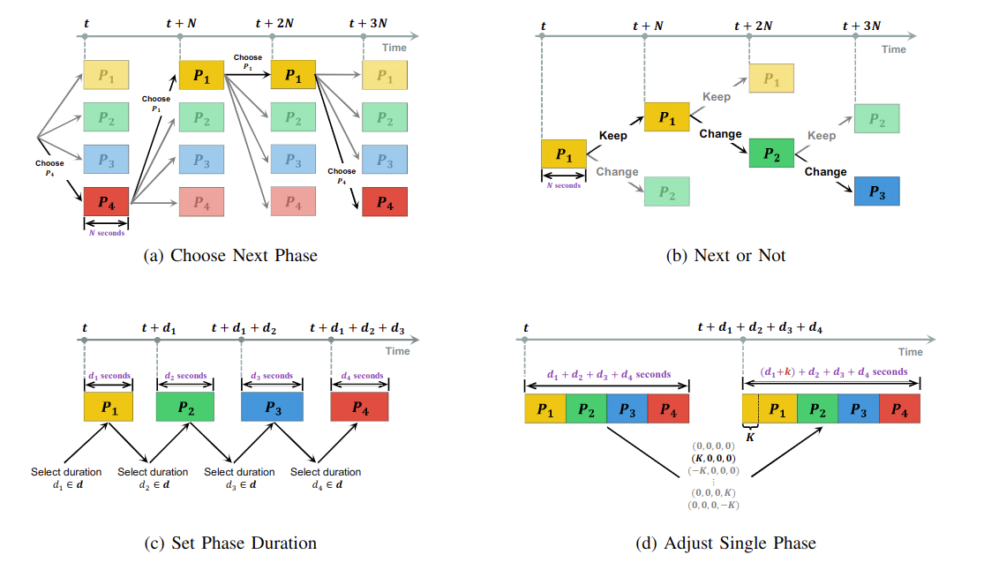
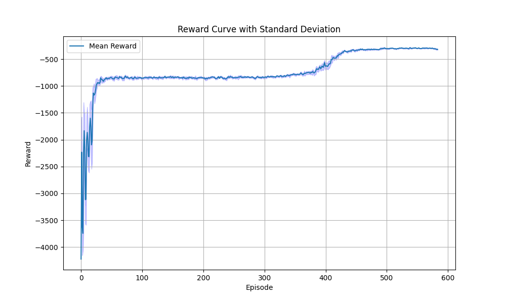

<!--
 * @Author: WANG Maonan
 * @Date: 2023-03-22 16:59:42
 * @Description: README for Paper AAP with CCDA
 * @LastEditTime: 2024-06-28 20:36:52
-->
# Traffic Signal Cycle Control with Centralized Critic and Decentralized Actors under Varying Intervention Frequencies

This repository contains the code for the paper "Traffic Signal Cycle Control with Centralized Critic and Decentralized Actors under Varying Intervention Frequencies".

- [Traffic Signal Cycle Control with Centralized Critic and Decentralized Actors under Varying Intervention Frequencies](#traffic-signal-cycle-control-with-centralized-critic-and-decentralized-actors-under-varying-intervention-frequencies)
  - [🎉 News](#-news)
  - [🔑 Key Points](#-key-points)
  - [📥 Installation](#-installation)
  - [🏃‍♂️ Training](#️-training)
  - [🧪 Evaluation](#-evaluation)
  - [📚 Citation](#-citation)

## 🎉 News

1. We have successfully implemented all commonly used `Action Designs` in traffic signal control. These include `Choose Next Phase`, `Next or Not`, `Set Current Phase Duration`, `Adjust Single Phase`, and `Adjust All Phases`. The weights for each model have been uploaded to the `save_models` directory corresponding to each method.
2. We have migrated the simulation platform used in this project from Aiolos to [TransSimHub](https://github.com/Traffic-Alpha/TransSimHub) (TSHub). We would like to express our sincere gratitude to our colleagues at SenseTime, **@KanYuheng (阚宇衡)**, **@MaZian (马子安)**, and **@XuChengcheng (徐承成)** (in alphabetical order) for their valuable contributions. The development of TransSimHub (TSHub) is a continuation of the work done on Aiolos.

## 🔑 Key Points

- **Adaptation to Varying Intervention Frequencies**: The intervention frequency significantly impacts the effectiveness of traffic signal control systems, influenced by factors such as resource limitations, safety, traffic flow disruption, and system stability. This research introduces varying intervention frequencies to the TSC system, defining it as the rate at which traffic signals are adjusted in response to changing traffic conditions. This approach is particularly beneficial for scenarios requiring manual verification, where lower frequencies may be preferable.

<div align=center>
   
</div>
<p align="center">An example of applying the intervention frequency based on cycle-based control action design in a four-phase traffic signal system</p>


- **Enhanced Action Utilization**: To accommodate varying intervention frequencies, particularly lower frequencies, it is crucial for the control agent to maximize the impact of each action taken. Our research introduces a novel action strategy named `adjust all phases`, which allows for the simultaneous adjustment of all traffic phases within a single cycle, thereby increasing the effectiveness of each intervention.

<div align=center>
   
</div>
<p align="center">An example of adjust all phases in a four phases traffic signal system</p>


- **Efficient Management of Large Action Spaces**: This research employs a Centralized Critic and Decentralized Actors (CCDA) architecture to effectively manage large action spaces. Decentralized actors are responsible for adjusting individual signal phases, which reduces the complexity of the action space. Simultaneously, a centralized critic evaluates the overall traffic scenario, ensuring coordinated actions among the decentralized actors, thus enhancing overall system performance.

<div align=center>
   
</div>
<p align="center">The framework of our method with the intervention frequency</p>


## 📥 Installation

Before using, make sure [TSHub](https://github.com/Traffic-Alpha/TransSimHub/tree/main) is installed.

```shell
git clone https://github.com/Traffic-Alpha/TransSimHub.git
cd TransSimHub
pip install -e ".[rl]"
```

## 🏃‍♂️ Training

Once TSHub is installed, you can start training models. We provide five different agent designs, each in its own folder:

1. [Choose Next Phase](./Choose_Next_Phase/): Chooses a phase from all possible phases at each time step.
2. [Next or Not](./Next_or_Not/): Decides whether to switch to the next phase at each time step.
3. [Set Phase duration](./Set_Current_Phase_Duration/): Sets the phase duration at the beginning of each phase.
4. [Adjust Single Phase](./Adjust_Single_Phase_Cycle/): Modifies a single phase in the entire cycle.
5. [Adjust All Phases](./Adjust_All_Phases_Cycle/): A method proposed in this project that adjusts all phases.

Each folder has the following structure:

```
- METHOD_NAME
   - train_utils/ # Contains training-related code, such as network structure
   - env_utils/ # Environment-related code, state, action, reward
   - train_METHOD_NAME.py # Training script
   - eval_METHOD_NAME.py # Testing script
   - train_deltas.sh # Script for training at different delta times
```

The image below illustrates the four commonly adopted agent designs for TSC tasks:

<div align=center>
   
</div>
<p align="center">Four Commonly Used Agent Designs</p>

To train a model, run the `train_METHOD_NAME.py` script. For instance, to train the `Adjust_All_Phases_Cycle` model with 20 simultaneous simulations and an action interval of 60 seconds, use the following command:

```shell
python train_adjust_all_phases.py --delta_time 60 --num_envs 20
```

You can also use the `train_deltas.sh` script to train models at different delta times more conveniently:

```shell
nohup bash train_deltas.sh > train_deltas.log &
```

After training, two folders, `log` and `save_models`, will be created. The `log` folder contains the cumulative rewards of each simulation during training, useful for plotting reward curves. The `save_models` folder stores the model weights saved during training for testing. Use the `plot_rewards.py` script to plot the reward curve:

```shell
python plot_rewards.py --action_type Adjust_All_Phases_Cycle --delta_time 60
```

The image below illustrates the reward curve for `Adjust_All_Phases_Cycle` when $\Delta t =60$.

<div align=center>
   
</div>
<p align="center">The Reward Curve for Adjust All Phases (delta t=60)</p>

## 🧪 Evaluation

After training, you can test the models by loading the saved weights from the `save_models` folder. Use the `eval_METHOD_NAME.py` script for testing. For instance, to test the `Adjust All Phases` model with a delta time of 60, use the following command:

```shell
python eval_adjust_all_phases.py --delta_time 60
```

The test script generates an `exp_output` file, which includes vehicle information (`tripinfo.out_1.xml`) and traffic light phase information (`./add/tls_programs.out_1.xml`). Use the `analysis_tripinfo.py` script to analyze the `tripinfo.out_1.xml` file:

```shell
python analysis_tripinfo.py --action_type Adjust_All_Phases_Cycle --delta_time 60
```

Upon running the above command, a statistical analysis of various attributes such as travel time, waiting time, and waiting count will be displayed. Here's a sample output:


```
Statistics for travelTime:
  Mean: 111.31
  Variance: 3493.35
  Max: 323.00
  Min: 41.00
  Percentile_25: 64.00
  Percentile_50: 88.00
  Percentile_75: 148.00

Statistics for waitingTime:
  Mean: 44.33
  Variance: 3021.38
  Max: 236.00
  Min: 0.00
  Percentile_25: 0.00
  Percentile_50: 20.00
  Percentile_75: 74.00

Statistics for waitingCount:
  Mean: 0.86
  Variance: 0.74
  Max: 8.00
  Min: 0.00
  Percentile_25: 0.00
  Percentile_50: 1.00
  Percentile_75: 1.00

...
```

You can also use the `plot_tls_program.py` script to visualize the phase changes of the traffic signal light. Note that this is not applicable for the `Choose Next Phase` model as it doesn't have a concept of a signal light cycle. For instance, to plot the phase change of `Adjust All Phase` with an interval of 60 seconds, use:

```shell
python plot_tls_program.py --action_type Adjust_All_Phases_Cycle --delta_time 60
```


## 📚 Citation

If you find this work useful, please cite our papers:

```bibtex
@article{wang2024traffic,
   title={Traffic Signal Cycle Control with Centralized Critic and Decentralized Actors under Varying Intervention Frequencies}, 
   author={Maonan Wang and Yirong Chen and Yuheng Kan and Chengcheng Xu and Michael Lepech and Man-On Pun and Xi Xiong},
   year={2024},
   journal={arXiv preprint arXiv:2406.08248},
}
```