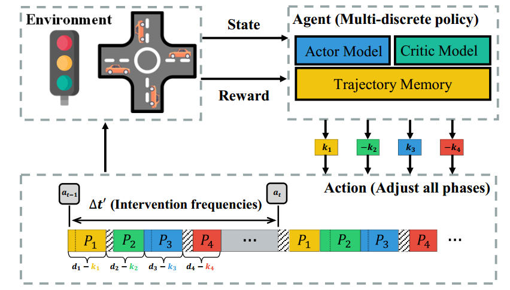
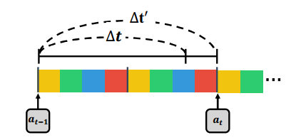
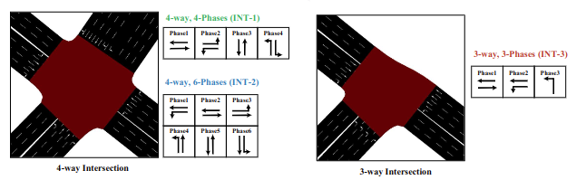
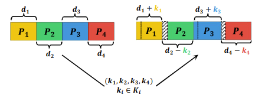

# MDLight under varying intervention frequencies


[MDLight under varying intervention frequencies（中文文档）](./README_zh_CN.md)

## Outline

- [MDLight under varying intervention frequencies](#mdlight-under-varying-intervention-frequencies)
  - [Outline](#outline)
  - [Introduction](#introduction)
  - [What is Intervention Frequencies](#what-is-intervention-frequencies)
  - [SUMO Network](#sumo-network)
  - [Five Action Designs in existing RL-based TSC methods](#five-action-designs-in-existing-rl-based-tsc-methods)
  - [Getting Start](#getting-start)


## Introduction

`MDLight` is an implementation of `A multi-discrete reinforcement learning framework for adaptive traffic signal cycle control under varying intervention frequencies`. 

In this paper, we propose a framework that can achieve good performance under different intervention frequencies. The **intervention frequency** is an important factor in realworld TSC system due to *limited resources*, *safety concerns*, *disruption to traffic flow*, and *stability of the system*. The following figure illustrates the overall structure of the proposed framework, including the (1) new action design, (2) multi-discrete policy optimization approach. 

<div align=center>
  
</div>

We pay more attention to the following points:

- The TSC system in this study explicitly considers intervention frequency. We analyze the learned policies and compare the performance of different TSC
methods under varying intervention frequencies.
- We present an adaptive control framework named **MDLight** that utilizes a novel action design adjust all phases with a multi-discrete policy optimization algorithm for the TSC problem.

## What is Intervention Frequencies

In RL-based TSC, the intervention frequency refers to the rate at which the agent modifies the traffic signal in response to variations in traffic patterns. The following figure illustrates the application of the intervention frequency in a cycle control action design, such as *adjust single phase*.

<div align=center></div>


## SUMO Network

The [nets](./nets) folder includes the sumo maps and routes. As depicted in the following figure, the topologies and phases of the three intersections are described as follows:

- **INT-1**, a 4-way intersection with $4$ phases; 
- **INT-2**, a 4-way intersection with $6$ phases; 
- **INT-3**, the 3-way intersection scenario with $3$ phases.

<div align=center></div>


## Five Action Designs in existing RL-based TSC methods

The existing RL-based studies primarily employ one of the following four action designs:

- [Choose next phase](./ChooseNextPhase), choosing a phase among all possible phases at each time step.
- [Next or not](./NextorNot/), determining whether to change to the next phase or not at each time step. 
- [Set current phase duration](./SetCurrentPhaseDuration/), setting the phase duration at the beginning of each phase.
- [Adjust single phase](./CycleSinglePhaseAdjust/), modifying only one phase in the whole cycle. 

The following figure illustrates examples of these four action designs for a TSC system with four phases, with the assumption that the starting time is at time $t$.

<div align=center></div>

In this paper, we propose a novel action design named `adjust all phases`, which can modify the duration of all phases in one cycle. The following figure illustrates examples of action design `adjust all phases`.

<div align=center></div>

There are two variants of `adjust all phases`:

- [MDLight (Discrete)](./CyclePhaseAdjust_Discrete/).  This approach directly applies adjust all phases, where the action space covers all possible combinations of all phase duration changes. However, action space will increase exponentially when the number of phases becomes larger. The PPO-Clip model is used in this approach.
- [MDLight (Multi-Discrete)](./CyclePhaseAdjust_MultiDiscrete/). In contrast to the simple adjust all phases approach, MDLight (multi-discrete) converts discrete actions to multi-discrete actions by using a vector of individual discrete actions for each phase. This approach significantly reduces the size of the action space, especially when the number of signal phases is large. Furthermore, the multi-discrete policy optimization algorithm is utilized to optimize the policy


## Getting Start

All the scripts can be found in [scripts](./scripts/). For example, we can run the following command to train the models with of five action designs separately on $\Delta=60$, **INT-1**:

```shell
bash ./scripts/delta_60/fourWay_4phase_stable.sh
```
